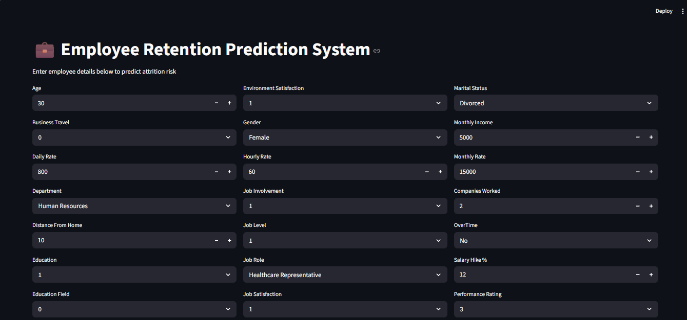
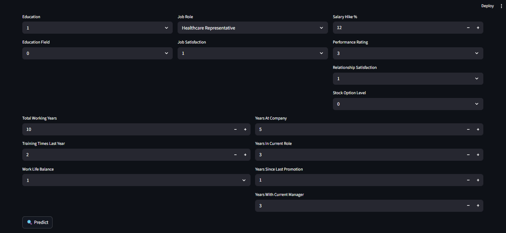
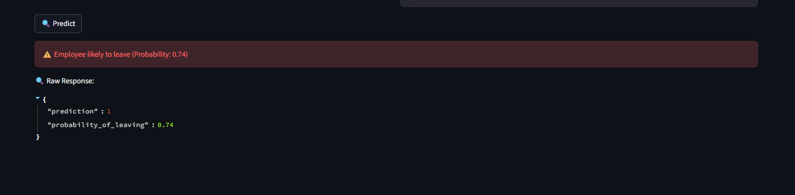
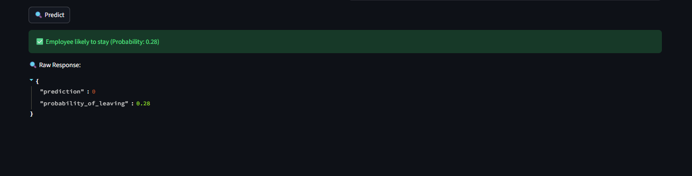
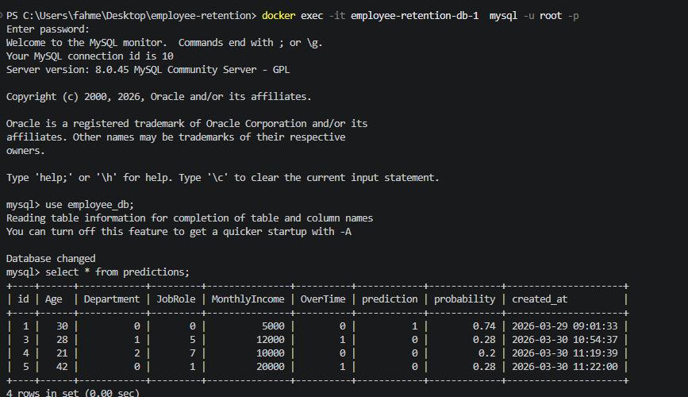
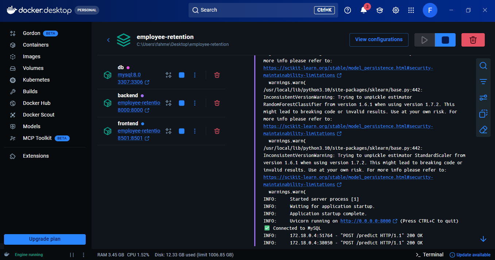

# 💼 Employee Retention Prediction System

An end-to-end Machine Learning project that predicts whether an employee is likely to leave a company based on various factors.

---

## 🚀 Tech Stack

* **Machine Learning**: Scikit-learn
* **Backend**: FastAPI
* **Frontend**: Streamlit
* **Database**: MySQL
* **Deployment**: Docker & Docker Compose

---

## 📊 Project Workflow

1. Data collected from Kaggle
2. Data cleaning & preprocessing using Pandas
3. Feature engineering & encoding
4. Model training using Machine Learning algorithms
5. Model evaluation & selection
6. Backend API built using FastAPI
7. Frontend UI built using Streamlit
8. Predictions stored in MySQL database
9. Fully containerized using Docker

---

## 🧠 Features

* Predict employee attrition risk
* Displays probability of leaving
* Stores predictions in MySQL database
* Fully Dockerized application
* Clean UI for user interaction

---

## ⚙️ How to Run (Docker)

```bash
docker-compose up --build
```

Then open:

```
http://localhost:8501
```

---

## 📌 API Endpoint

```
POST /predict
```

---

## 📷 Screenshots

### 🔹 Input Form

<p float="left">
  
  
</p>

---

### 🔹 Prediction Results

<p float="left">
  
  
</p>

---

### 🔹 Database (MySQL)



---

### 🔹 Docker Containers Running



---

## 🗄️ Database

* MySQL container used
* Stores prediction history
* Includes probability and prediction results

---

## 🎯 Future Improvements

* Add authentication system
* Deploy on cloud (AWS / Render)
* Add model explainability (SHAP)
* Add prediction history UI in Streamlit

---

## 👨‍💻 Author

**Faisal Ahmed**
Aspiring Machine Learning Engineer

---

## ⭐ If you like this project, give it a star!
